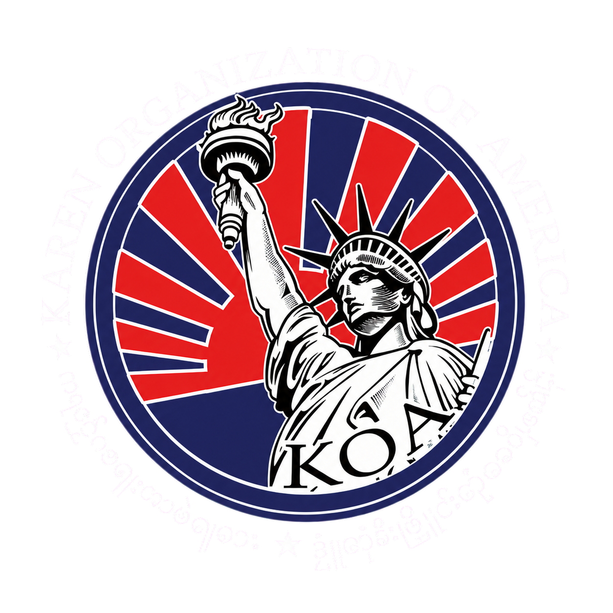

# KOA cinematic website cookbook

Status: local design and motion source of truth. Publication and cultural approval remain separate gates.

## Purpose

The website should feel like a patient documentary when someone is discovering KOA and a clear tool when they need to act. The cinematic layer establishes belonging, seriousness, and cultural continuity. It must never obscure a foreground message, invent a program outcome, or delay a visitor who already knows where they are going.

## Non-negotiables

- Preserve the K–seal-as-O–A choreography. The hero seal begins large, K and A form from glyphs, the seal flies to the initially empty header slot, and the delayed glyph O converges only after the seal lands.
- Use native scrolling. Visual progress may lag, ease, and hold, but wheel, touch, keyboard, scrollbar, and assistive navigation are never captured.
- Keep the desktop film at `1800vh`; mobile may use the current `1440vh` runway to avoid excessive touch travel while retaining the same chapter holds.
- One cinematic message per viewport. Images may be full-bleed, but text, controls, chapter numerals, and glyphs cannot compete for the same focal plane.
- Foreground text, photographs, navigation, forms, links, buttons, and cards occlude the ambient glyph field and the cursor matrix.
- Motion off and `prefers-reduced-motion` must resolve to complete, truthful, readable states with no frozen particle piles.
- Burmese chapter numerals are atmospheric and legible; the brief Arabic companion is orientation, not a strobe.
- Red leads interaction, gold marks ceremony, Hermes blue carries the field. Avoid neon, saturated particle walls, and solid-looking numeral formations.
- No deployment, publication, cultural claim, translation, donation processor, or public proof is implied by source work.

## Visual tokens

| Role | Token | Current value | Guardrail |
|---|---|---:|---|
| Deep field | `--ink-950` | `#05090e` | Use at page boundaries and letterbox only |
| Hermes field | `--hermes-blue` | `#0b1830` | Primary luminous background |
| Deep Hermes | `--hermes-blue-deep` | `#071127` | Header and transition depth |
| Karen red | `--red-bright` | `#df5b68` | Active, hover, and status emphasis |
| Torch gold | `--gold` | `#d4a24e` | Ceremony, numeral orientation, fine rules |
| Woven paper | `--paper` | `#f2ead9` | Primary editorial copy and orbit type |
| Cinematic easing | `--ease-cinematic` | `cubic-bezier(0.16, 1, 0.3, 1)` | Long arrivals and fades |
| Breathing easing | `--ease-breath` | `cubic-bezier(0.22, 0.61, 0.24, 1)` | Hover/focus and navigation |
| Hover wipe | `--glimmer-duration` | `2.35s` | One slow pass; no looping shimmer |

Typography is Bodoni Moda for English display, Manrope for body and utility copy, and Noto Serif Myanmar for Karen/Myanmar text. Do not add decorative type families unless one of these roles is being replaced everywhere.

## Opening choreography

| Beat | Arrival progress | Visual owner | Required result | Tunable inputs |
|---|---:|---|---|---|
| Seal at rest | `0.00–0.06` | Seal and orbit | Large centered identity; rays nearly invisible | halo size, orbit alpha, ray alpha |
| K/A gathering | `0.06–0.42` | GlyphStage arrival | Sparse glyphs settle into K and A around the seal | sample width, particle spring, formation alpha |
| Reading hold | `0.42–0.58` | Complete K–seal–A | Visitor gets an uninterrupted identity beat | scroll buffer, arrival rate |
| Seal flight | `0.58–0.72` | Measured logo flight | Seal follows a curved rendered path into empty header mark | arc height, quint easing, target scale |
| Glyph O | `0.73–0.86` | Off-screen O particles | O converges from all four viewport edges after the seal lands | O spring, stagger, alpha |
| Mission reveal | `0.88–0.965` | Copy and completed KOA | Organization name and message resolve after identity | blur, word delay, line height |
| Handoff | `0.975–1.00` | Dispersal and film | Arrival field releases into Chapter 1 without a hard cut | scatter distance, film hold |

The scroll cue begins glowing only after the opening composition is ready. The header begins slightly expanded, becomes compact after handoff, and expands gently on hover or keyboard focus.

## Ambient glyph system

Movement name: **Anchored Breath**. The page is an invisible cultural field in which letters behave like dust suspended in slow water. Seeded randomness makes every verification repeatable, while life cycles, course retargeting, and opacity envelopes prevent the field from feeling tiled or stationary. Craft lives in restraint: the algorithm is successful when the viewer senses the field before consciously counting glyphs.

The anchor outline for a letter or numeral is never drawn. A sparse subset approaches sampled targets while unassigned glyphs continue drifting. Spring force becomes gentler as distance grows, so dispersion and re-formation feel patient rather than magnetized. Formation alpha must remain transparent enough for image and copy hierarchy to win.

The cursor matrix is a second, local field. It appears only in an approximately `132–176px` radius around the pointer, uses a `30–34px` grid, drifts a few pixels, and changes its seeded S’gaw Karen/K/O/A selection slowly. Dither thresholds remove regular edges. Every cell checks the foreground occlusion map before drawing.

The system is deliberately built in the existing deterministic canvas rather than adding a second p5.js or Magic UI runtime. This keeps one animation loop, one motion-off state, one occlusion map, and one seeded source of truth.

### Glyph controls

| Parameter | Current value | Safe range | Effect |
|---|---:|---:|---|
| Ambient desktop particle cap | `480` | `300–560` | Background dust density |
| Ambient mobile minimum | `120` | `90–180` | Small-screen texture |
| Ambient maximum alpha | `0.03` | `0.018–0.04` | Resting field subtlety |
| Cursor radius | `132–176px` | `120–190px` | Hover reveal footprint |
| Cursor grid spacing | `30–34px` | `28–40px` | Matrix openness |
| Cursor maximum alpha | about `0.135` | `0.08–0.15` | Revealed matrix visibility |
| Direction retarget interval | `2.6–8.2s` | `2–10s` | School-like course changes |
| Ambient life | `9–26s` | `8–32s` | Fade/respawn cadence |
| Corona ray count | `54 mobile / 92 desktop` | `40–110` | Halo texture, not brightness |
| Corona glyph alpha | `0.018–0.063` | `0.012–0.07` | Boundaryless ray subtlety |

Allowed cursor-matrix glyph vocabulary is defined in `SGAW_KAREN_CURSOR_GLYPHS` and is limited to K, O, A, and reviewed S’gaw Karen clusters already present in the identity orbit. Do not add English words, ASCII noise, generic Burmese numerals, or unreviewed translated phrases to this layer.

## Film and chapter grammar

| Chapter | Numeral | Door | Image motion | Single message |
|---|---|---|---|---|
| 1 | `၁` | Rack focus | 24-second crowd zoom-out/breathe | The people are the story |
| 2 | `၂` | Curtain wipe | Slow crop drift | KOA is one roof for community needs |
| 3 | `၃` | Iris | Subtle focus pull | Culture is lived, not archived |
| 4 | `၄` | Rise | Gentle vertical reveal | The future is built with the community |
| 5 | `၅` | Parting veil | Warm dusk hold | Participation is the next chapter |

At each boundary: the prior scene releases; a full-viewport sparse glyph numeral converges around an invisible outline; the numeral breathes; the brief Arabic companion identifies it; glyphs disperse; the next image and one message enter. `CHAPTER_HOLD_MS` protects this transition from large wheel jumps.

## Foreground interaction language

- Interactive navigation, pills, buttons, cards, and disclosure triggers receive one red-to-paper-to-gold glimmer on hover or focus.
- The wipe lasts `2.35s`, does not loop, and disappears entirely with reduced motion or Motion off.
- Focus must receive the same discoverability as hover. Touch gets the static foreground state.
- Cards may rise only slightly. A glow may clarify an active or successful state; it cannot decorate inactive filler.
- Donation or “Join” actions may recur in the header and at relevant chapter endings, but all payment and receipt claims remain unimplemented until a processor and nonprofit policy are approved.

## Page and tab pattern sheet

Use a different information form for each destination while keeping the same tokens and motion grammar.

| Page/tab | Opening form | Primary information form | Ending form | Status |
|---|---|---|---|---|
| Home | K–seal–A arrival | Five-chapter film | Join/donate invitation | Implemented locally |
| About | Archival chapter glyph | Timeline with one era per viewport | Leadership/community review invitation | Later phase |
| Programs | Service emblem convergence | One program per cinematic panel | Eligibility/contact action | Later phase |
| Stories | Full-bleed portrait/photo | One voice per viewport | Next story / contribute | Later phase |
| Music | Sound-led waveform glyphs | One performance or archive item | Listen/contribute rights-gated action | Later phase |
| Coming Soon | Transparent future numeral | Truth-state roadmap | Join research/review invitation | Partial |
| Contact | Quiet emblem | One contact purpose per panel | Send/recover state | Existing page; later polish |

## Fillable section card

Copy this block for every new section before implementation.

| Field | Value |
|---|---|
| Page and section | |
| Audience | |
| One message | |
| Evidence/source | |
| Foreground content | |
| Background image/art | |
| Entry door | |
| Hold duration | |
| Exit door | |
| Chapter glyph | |
| Glyph anchor and density | |
| Cursor behavior | |
| Hover/focus behavior | |
| Motion-off composition | |
| Mobile composition | |
| Primary action | |
| Approval gate | |
| Browser proof required | |

## SEO and content guardrails

- Keep one descriptive H1 and a logical heading hierarchy; decorative numerals remain `aria-hidden`.
- Use “Karen Organization of America” and “KOA” naturally in titles, descriptions, organization schema, image alt text, and visible copy.
- Preserve useful text in the DOM. Do not encode essential content only in canvas, images, or animation.
- Give every indexable destination a unique title, description, canonical URL, and English/Karen alternate once translations are reviewed.
- Prefer real organization and community photographs with permission and provenance. Generated or illustrative images must not be presented as documentary evidence.
- Front-page ranking is a research and authority outcome, not a design claim. Technical SEO can be verified locally; search position requires external evidence over time.

## Acceptance and proof

- Desktop 1440×900 and mobile 390×844 have zero horizontal overflow.
- Film chrome does not overlap at either viewport.
- Cursor matrix appears on empty backgrounds, fades at its radius, uses only the allowed glyph set, and is absent over a sampled foreground point.
- Halo ray intensity remains below the restrained maximum during normal scroll.
- K–seal–A phases and logo landing remain observable in order.
- All five chapter numerals activate, with a readable hold between scene messages.
- Motion off and reduced motion show complete content, stable header identity, no canvas clutter, and no glimmer animation.
- Browser console/runtime exception list is empty.
- Source contracts, JavaScript syntax, build checks where available, and a staged-diff review pass before commit.

## Phase boundary

This cookbook does not authorize implementation of every later-page pattern in one pass. Finish and verify one bounded page or component family, then update the section card, proof, adherence ledger, progress, and decisions. Commit and push source only after that phase is verified. Deployment and official publication remain a separate explicit approval.

## Phase 7 canonical one-app rule

The React App Router in `C:\Users\olive\Projects\koa-website` on `main` is the sole canonical KOA runtime. The historical bilingual feature commit is already merged. Its worktree will be retired only after generated artifacts are reviewed. `public/koa` remains a temporary read-only browser/reference film until React parity is verified; do not implement new product features twice.

Approved design: [KOA canonical one-app consolidation](superpowers/specs/2026-08-24-koa-canonical-one-app-consolidation-design.md).

### Exact seal and orbit contract

- The source is [`koa-seal-white-lettering-v2.png`](../public/koa/assets/koa-seal-white-lettering-v2.png).
- The white English and Karen text embedded around the Statue of Liberty is part of the logo.
- Render the inner seal stationary and rotate only an annular crop of the same file.
- The annular crop and core always share center, scale, translation, and proportional radius.
- Remove added SVG orbit words. Never add a second circumference outside the supplied lettering.

### Persistent glyph-path contract

- Give every glyph particle a stable ID and page-lifetime path state.
- Formation and dispersion retarget paths; they do not destroy particles when a brief class or scroll window ends.
- Keep the invisible symbol anchor stable while particles breathe around it.
- Reduce speed with distance from the anchor so outer dispersion slows instead of vanishing.
- Keep numeral and K/A formations sparse, translucent, and legible rather than solid.
- Continue measuring visible foreground rectangles and suppress all matrix and ambient glyph drawing inside them.

### Partner and Karen-organization cinema

- Two rows travel slowly in opposite directions on a time-based loop; they are not scroll-linked.
- Pause each row on hover and keyboard focus.
- Motion off and reduced motion show a quiet wrapped grid.
- Records require organization name, relationship status, logo source, permission status, URL, and reviewer.
- Draft or unverified relationships stay inside admin preview and cannot be described publicly as partners.

### Mobile-first authoring preview

The protected Design Studio includes a `390×844` phone preview of the real canonical route. It is recursion-safe, keyboard accessible, and compares mobile, desktop, and Motion-off states. This is an authoring feature under `/[lang]/admin/design-studio`, not a public phone decoration.

### Language Studio

English is the default source. Thai (`th`), Burmese (`my`), and S'gaw Karen (`ksw`) are parallel locale proposals derived independently from English. S'gaw Karen proposals are always review-gated. Store provider/model, confidence, provenance, source revision, review status, reviewer, and supersession history. Never call unreviewed proposals training data.

## Failed, blocked, and superseded idea register

| Attempt | What happened | What the canonical app does |
|---|---|---|
| Magic UI glyph-matrix installer | npm dependency resolution failed; the bounded retry hit `ENOSPC` | Keep one first-party seeded canvas until a component proves materially better |
| Narrow seal-flight headless probe | Two condition-based attempts timed out | Add durable phase telemetry and stable browser milestones |
| Multiple bilingual/static vinext watchers | HMR loop and stale-route risk | Run exactly one canonical React process |
| Build without `vinext.cmd` | Build could not start | Preflight free disk and restore dependencies safely |
| Added SVG orbit outside the raster seal | Duplicated the supplied identity | Rotate only the exact seal's annular text crop |
| Static and React products evolving together | Drift and duplicated work | React is canonical; static is a temporary reference |
| Chained English → Thai → Burmese → Karen translation | Error and provenance compound at each hop | Generate independent proposals from English |
| Short-lived glyph dispersion classes | Paths can disappear when the state window closes | Use stable particle IDs and persistent retargetable paths |

## Reference strength and consideration weights

Strength measures authority and reliability. Consideration measures how strongly a reference should shape this implementation. Both range from 0 to 100.

| Reference | Strength | Consideration | Guardrail |
|---|---:|---:|---|
| Current explicit user instructions | 100 | 100 | Highest-priority product intent |
| Supplied exact seal asset | 100 | 100 | Geometry and embedded text are fixed |
| Approved one-app architecture | 100 | 100 | One main React runtime |
| Current main React source | 95 | 100 | Canonical implementation baseline |
| Fresh browser evidence | 95 | 95 | Governs regression decisions |
| Existing K–seal–A cookbook contract | 90 | 95 | Preserve choreography |
| KOA-approved copy/assets | 100 | 100 | Applies after approval is recorded |
| Local Facebook-derived enhanced images | 60 | 50 | Draft only until originals and rights are documented |
| Official KOA Facebook page | 80 | 60 | Discovery source, not automatic permission |
| Referenced typography/halo site | 65 | 55 | Mood and technique, not cloning |
| Algorithmic-art principles | 70 | 65 | Seeded natural motion and tunable behavior |
| Generic component trends | 30 | 20 | Use only when mission and accessibility improve |

## Media and source reference shelf

### Media

- [Exact seal](../public/koa/assets/koa-seal-white-lettering-v2.png)
- [Capitol community group](../public/koa/assets/fb-capitol-group-mobile-enhanced.png)
- [Community group](../public/koa/assets/fb-community-group-mobile-enhanced.png)
- [Capitol flags](../public/koa/assets/fb-capitol-flags-mobile-enhanced.png)
- [Outdoor gathering](../public/koa/assets/fb-outdoor-gathering-mobile-enhanced.png)
- [Cursor-matrix proof](../output/playwright/phase6-cursor-matrix.jpg)
- [Navigation-glimmer proof](../output/playwright/phase6-nav-glimmer.jpg)
- [Mobile-film proof](../output/playwright/phase6-mobile-film.jpg)
- [Mobile Motion-off proof](../output/playwright/phase6-mobile-motion-off.jpg)
- [Runtime evidence JSON](../output/playwright/phase6-runtime-evidence.json)

### Relevant files outside this docs folder

- [React cinematic home](../components/CinematicHome.tsx)
- [Locale loader](../components/i18n.ts)
- [English messages](../messages/en.json)
- [Current Karen messages](../messages/karen.json)
- [Database schema](../db/schema.ts)
- [Static film markup](../public/koa/index.html)
- [Static film motion engine](../public/koa/storytelling.js)
- [Static film styles](../public/koa/storytelling.css)
- [Phase 6 browser verifier](../scripts/verify-phase6-cinema.cjs)
- [Project README and PowerShell handoff](../README.md)

## Versioned frame-story record

Each verified phase adds `docs/cinematic/versions/vNNNN-<short-sha>.md` and a matching machine-readable manifest. Every frame records route, locale, entry condition, viewport visibility, foreground copy, background art, static features, motion features, tunables, exit condition, evidence, provenance, approval status, and the reason it exists. Page-specific design, spec, and ideas live under `docs/pages/<route>/`.

The companion [`UNDERSTANDING.md`](../UNDERSTANDING.md) explains why every top-level first-party path exists, who owns and consumes it, what breaks if it is absent, how it is verified, and which approval/privacy boundary applies. Its marked repository registry is generated; human context outside the markers is preserved.

The validated project skills [`koa-mobile-preview`](../skills/koa-mobile-preview/SKILL.md), [`koa-translation-mapper`](../skills/koa-translation-mapper/SKILL.md), [`koa-frame-story-spec`](../skills/koa-frame-story-spec/SKILL.md), and [`repo-understanding-sync`](../skills/repo-understanding-sync/SKILL.md) provide narrow, approval-aware workflows for mobile proof, independent translation proposals, frame snapshots, and repository understanding sync.

The home route keeps separate [design](pages/home/design.md), [spec](pages/home/spec.md), and [ideas](pages/home/ideas.md) records. The deterministic Phase 7 record is available as [Markdown](cinematic/versions/v0007-phase7.md) and [JSON](cinematic/versions/v0007-phase7.json).

## PowerShell viewing contract

The temporary static reference and planned permanent React command are documented in the [README](../README.md). The eventual `scripts/run-koa.ps1` preflights disk space, starts one vinext process, waits for readiness, opens the local URL, and prints its stop command. It never deploys.
